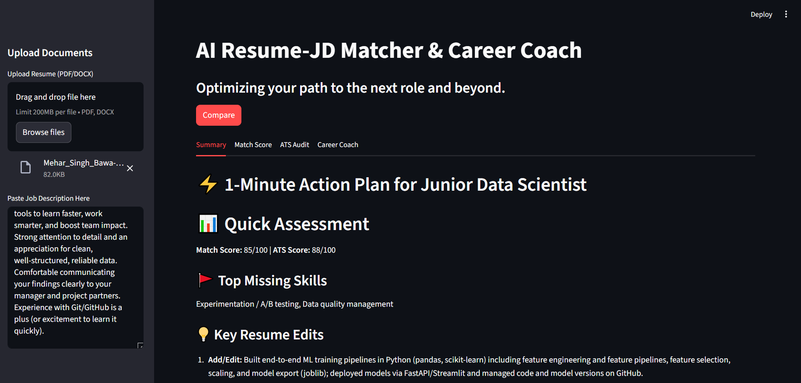

# AI Resume-JD Matcher & Career Coach

An industrial-grade, multi-agent system designed to bridge the gap between job seekers and Applicant Tracking Systems (ATS). Built with **LangGraph**, **OpenAI** and **Streamlit**, this tool provides deep technical analysis, ATS optimization, and strategic career coaching.

## Key Features

- **Multi-Agent Orchestration**: Powered by LangGraph to manage state across four specialized AI agents.
- **Precision Extraction**: Uses Pydantic-enforced schemas to parse complex Resume.
- **ATS Intelligence**: Heuristic-based scoring for readability and keyword density.
- **Actionable Coaching**: Gives resume key changes bullet points and tailored interview strategies.
- **Executive Summary**: A "1-Minute Action Plan" for rapid application optimization.

## System Architecture

The project follows a modular pipeline where each agent specializes in a specific domain of the recruitment lifecycle.

1. **Parser Agent**: Extracts contact info, skills, and work history.
2. **Matcher Agent**: Evaluates technical alignment and identifies skill gaps.
3. **ATS Specialist**: Audits formatting and keyword searchability.
4. **Career Coach**: Synthesizes findings into a strategic preparation guide.

## Tech Stack

Orchestration: LangChain & LangGraph

UI Framework: Streamlit

LLM: OpenAI GPT-4o / GPT-4o-mini

Validation: Pydantic v2

Document Processing: PdfPlumber, Python-Docx

## Getting Started

1. **Installation**
Clone the repository and install the required dependencies: 
git clone [https://github.com/bawamehar/Resume-Screening-System.git]
pip install -r requirements.txt

2. **Environment Configuration**
Create a .env file in the root directory and add your credentials:
OPENAI_API_KEY=your_openai_api_key_here

3. **Execution**
Launch the Streamlit dashboard:
cd Resume-JD Matcher
streamlit run app.py

## Project Structure

```text
├── agents/           # Specialized Agent logic (Parser, Matcher, ATS, Coach)
├── core/             # Shared Pydantic models, prompts, and utilities
├── app.py            # Streamlit UI Entry Point
├── graph.py          # LangGraph Workflow Definition
├── main_agent_call.py # CLI Testing Sandbox
└── requirements.txt  # Dependencies

---




**Developed by Mehar Singh Bawa**